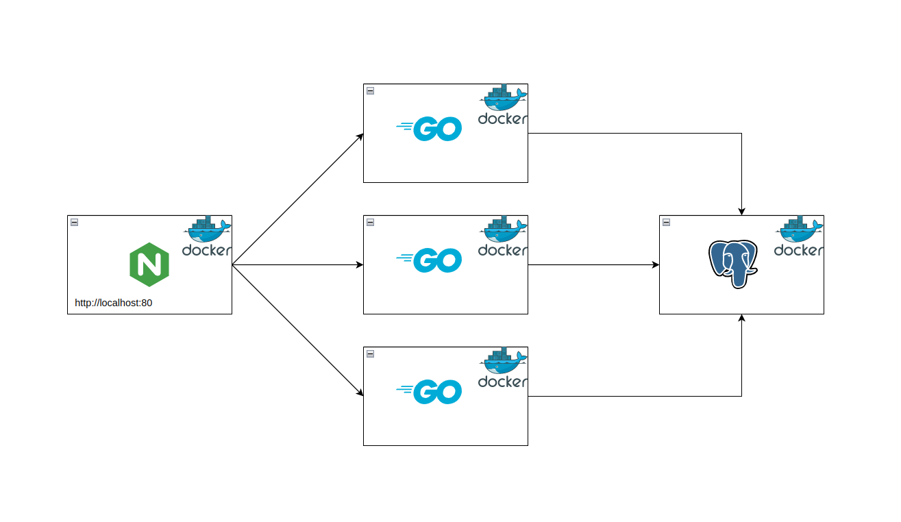

# Assignment

### Requirements
- Docker 
- Docker compose plugin
- Go (optional)
- Make (optional)

> NOTE: It is not necessary to run the ProductAPI without containerizing it first.

## Introduction
As a newly appointed DevOps engineer in a company, you have been assigned to a team that
is developing an application intended for daily use by thousands of users. The team has completed 
the initial features of the application and is now ready to deploy it on the staging environment 
for further testing.

The staging environment is expected to be used by a small group of users and Quality Assurance (QA) 
testers who will validate the solution. The QA team will run various tests, including assessing how 
the application handles concurrent HTTP requests under high load, such as running 100 virtual users
simultaneously, to evaluate the product's performance.

You can find the ProductAPI documentation in the repository at `./product/README.md.`

## Task
Your Chief Technology Officer (CTO) has assigned you the task of creating a containerized environment 
for this application, so that the entire project can be launched with a single command: `docker compose up`. 
The desired architecture is shown in the following diagram:

To achieve this, your CTO has provided a list of tasks:

1) The team responsible for the application has no experience with Docker, so the application needs to be containerized.

2) PostgreSQL database must be used for storage and should be containerized.

3) Nginx load balancer should be containerized.

4) Data in the PostgreSQL container must persist after container restarts.

5) To test the service under high load, multiple instances of ProductAPI container (e.g. 3) should be launched and fronted by an Nginx load balancer.

**Bonus**

1) The status/health of all services in the project should be checked regularly. 

2) All services should have a restart policy that will restart the container if it fails, but not allow the container to 
enter into a restarting loop.

---

*Good luck and happy coding... :)*

*Codebehind*
